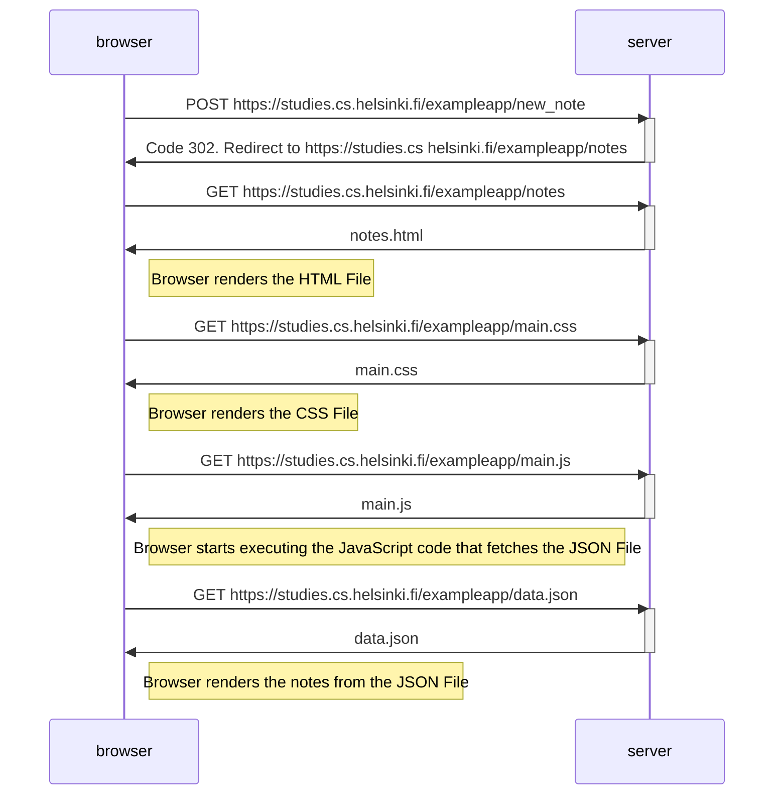

```mermaid
sequenceDiagram
    participant browser
    participant server

    browser->>server: POST https://studies.cs.helsinki.fi/exampleapp/new_note
    activate server
    server->>browser: Code 302. Redirect to https://studies.cs helsinki.fi/exampleapp/notes
    deactivate server

    browser->>server: GET https://studies.cs.helsinki.fi/exampleapp/notes
    activate server
    server->>browser:  notes.html
    deactivate server
    Note right of browser: Browser renders the HTML File


    browser->>server: GET https://studies.cs.helsinki.fi/exampleapp/main.css
    activate server
    server->>browser: main.css
    deactivate server
    Note right of browser: Browser renders the CSS File

    browser->>server: GET https://studies.cs.helsinki.fi/exampleapp/main.js
    activate server
    server->>browser: main.js
    deactivate server

    Note right of browser: Browser starts executing the JavaScript code that fetches the JSON File  
    
    browser->>server: GET https://studies.cs.helsinki.fi/exampleapp/data.json
    activate server
    server->>browser: data.json
    deactivate server

    Note right of browser: Browser renders the notes from the JSON File
```