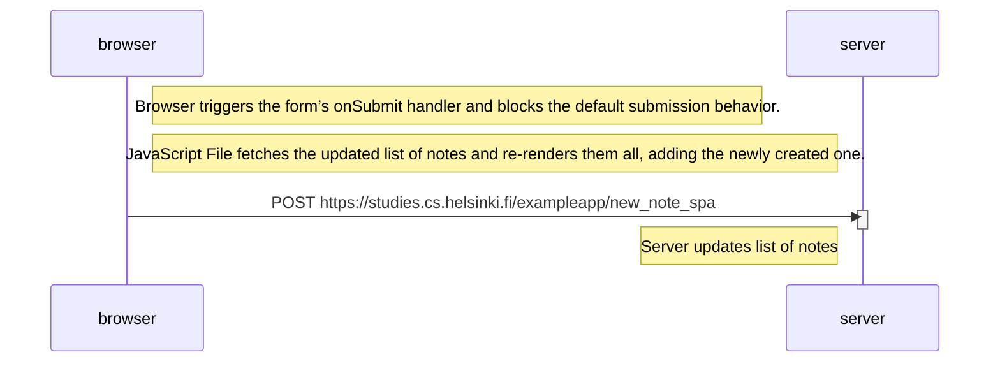

```mermaid
sequenceDiagram
    participant browser
    participant server

    Note right of browser: Browser triggers the form’s onSubmit handler and blocks the default submission behavior.
    Note right of browser: JavaScript File fetches the updated list of notes and re-renders them all, adding the newly created one.
    browser->>server: POST https://studies.cs.helsinki.fi/exampleapp/new_note_spa
    activate server
    deactivate server
    Note left of server: Server updates list of notes

```